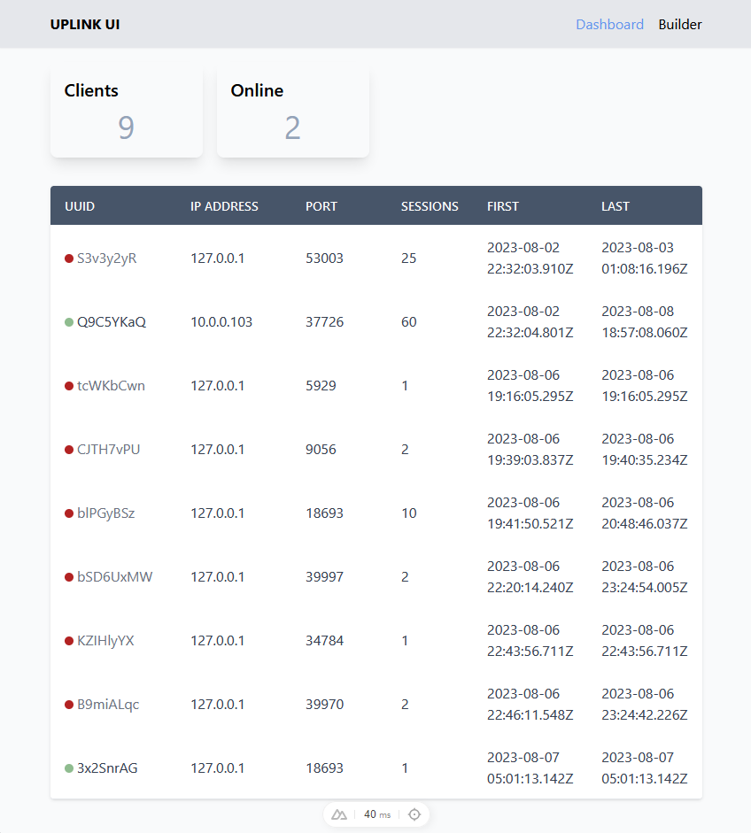

# UPLINK (Ultimate Persistent Linux Implant Network Kit)

Persistent reverse shell and connection manager. Originally designed for Linux but has cross platform support. Functionally a lightweight C2. The main idea is for a simple and modular C2 where all components can be hosted on a single server or have database, listener, builder, and interface all on seperate servers with any combination.  

[Demo Video (YouTube)](https://www.youtube.com/watch?v=qzB7AJMDosY)

## Installation/Usage

UPLINK will work on Windows or Linux

### Manual
This is probably the best approach for now. 

#### Backend/Database
Pocketbase is used on the backend (didn't feel like writing backend code) but will probably be switched for sqlite in the future. 

- Install pocketbase on your system
  - Place the prebuilt binary in the `pb` directory
- Start Pocketbase with `pocketbase serve`
- You will need to manually import the collection using `pb_schema.json` from the web interface for now

#### UPLINK server
- go run `UPLINK/server/uplink.go`
  
#### WebUI
- Navigate to `\uplink-fe` and run `npm install` (first run only) and then `npm run dev`

#### Builder
- Navigate to `UPLINK\builder` and start the Builder API `python app.py`
 
## Client

Main client is currently a lightweight python client. It's essentially a python reverse shell with some added features for client management and reconnection. Client will attempt to connect to the server if it fails it will sleep for some time and attempt reconnection. If the connection succeeds it sends a randomly generated `client id` to the server and starts a thread that sends a reverse shell to the socket connection.

### Implant Types

Python - Generic multipurpose reverse shell
Native Executable (C) (Work in progress)

## Server 

The server is a small go program that can multiplex connections from clients. It can accept connections from the python script or other valid reverse shells (untested). Clients get upserted into the database backend and can be managed through the CLI or using the API.  

### API Endpoints

`GET /status/` - Returns a JSON array of Client IDs present in `activeClients` slice

`POST /command/:id` - Sends a command to client based on ID and returns the result

## Web UI

Nuxt.js application for managing client connections. Intended to be used rather than the CLI. Future versions will include more robust client management features and payload builder/distribution support.  

## Builder 

Separate API for building and serving payloads. Right now only Python implant is functional. It will generate a payload with a random ID and host the payload at `{BUILDER_IP}:{BUILDER_PORT}/dl/{payload}`. 

## Backend (PocketBase)
PocketBase is used for backend and database management. Please read their documentation for more information.

## Requirements

- Go
- Node.js
- PocketBase
- Python Flask

## ToDo
- [ ] Windows Client (C)
- [ ] Linux Client (C)
- [ ] Netcat Client
- [ x ] Add builder to WebUI **[In progress]**
  - [ ] Support different client types
  - [ ] Allow hostname
  - [ ] Submit to payloads table
- [ ] Remove hardcoded values (Configuration) **[In progress]**
- [ ] Installation script